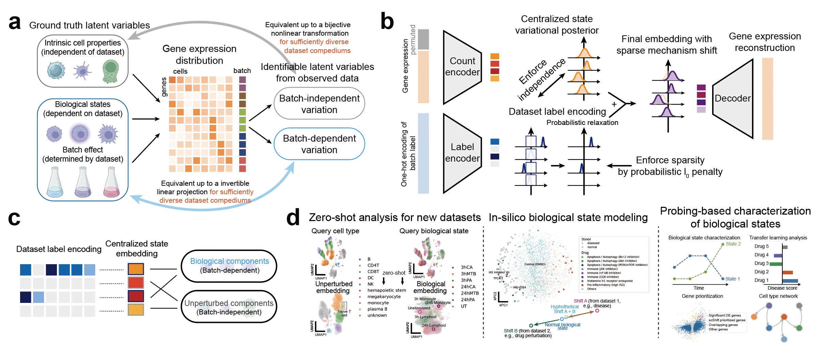

# scShift

How to identify true biological differences across samples while overcoming batch effects has been a persistent challenge in single-cell RNA-seq data analysis. We found that scaling up deep identifiable models leads to a surprisingly effective solution for this challenging task. We developed scShift, a deep variational inference framework with theoretical support for disentangling batch-dependent and batch-independent variations. Through training the model with compendiums of scRNA-seq atlases, scShift shows remarkable zero-shot capabilities in revealing representations of cell types and biological states in single-cell data while overcoming batch effects. scShift incorporates four important ingredients for next-generation single-cell computation models: 1) zero-shot, 2) disentanglement, 3) scaling performance, and 4) no need for external annotation (unbiased). Please refer to our manuscript for more details.

Read our preprint on BioRxiv: [Scaling deep identifiable models enables zero-shot characterization of single-cell biological states](https://www.biorxiv.org/content/10.1101/2023.11.11.566161v2)

## System requirements
### OS requirements
The scShift (pertvi) package is supported for all OS in principle. The package has been tested on the following systems:
* macOS: Monterey (12.4)
* Linux: Ubantu (20.04.5)
### Dependencies
See `setup.cfg` for details.

Installation instruction, our trained models, and a tutorial will be online soon.
